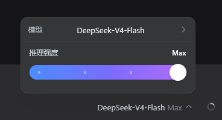

# DSH UI Rheostat

将 DSH Web 聊天输入区原有的模型/推理强度选择入口替换为推理强度滑动条。滑块会调用 DSH 的 `modelDirectories` 服务提交当前模型的 `reasoningEffort`，因此设置会作用于后续请求。

> 本包原为 `dsh-effort-switcher`，现重命名为 `dsh-ui-rheostat`。改名后**包名、Cordis 插件名、客户端模块 id、CSS 类前缀、样式标签 id 全部同步更换**，控件外观与行为保持不变。

## 屏幕截图




## 要求

- DSH `0.1.0-rc.6` 或兼容的 Web profile。
- 当前模型必须暴露至少一个 reasoning effort 级别。普通非推理模型不会显示滑块。

## 安装

本包是本地改造版，源码目录即本仓库。把它链进目标 profile：

```powershell
dsh plugin --profile desktop add D:\Desktop\dsh-effort-switcher
```

依赖名取自 `package.json` 的 `name`（即 `dsh-ui-rheostat`），并因 `dsh.bundle` 声明自动写入 `dsh.profile.bundles`。不必再编辑 profile 的 `cordis.patch.yml`。

> **上游原包**仍是 [`lemonorangeapple/dsh-effort-switcher`](https://github.com/lemonorangeapple/dsh-effort-switcher)（MIT）。
> 本项目在其基础上重命名并本地修补。不要再执行
> `dsh plugin --profile <p> add github:lemonorangeapple/dsh-effort-switcher`
> —— 上游包与本地包会注册同一个座位 `conversation.input.model`，同时安装会出现双重控件。

完全停止并重新启动宿主进程，然后刷新已打开的 GUI。DSH 仅在进程启动时扫描 `dsh.client` 元数据；仅刷新旧页面或运行独立开发服务器不会加载本插件。

如果 profile 的 `cordis.patch.yml` 里还留着旧的手工挂载（`id: ui-rheostat`），先删掉，避免双重挂载。

## 卸载

```powershell
dsh plugin --profile desktop remove dsh-ui-rheostat
```

卸载后同样需要重启宿主进程。

## 验证安装

在 profile 目录中运行：

```powershell
node --input-type=module -e "const plugin=await import('dsh-ui-rheostat'); console.log(plugin.name)"
```

预期输出：

```text
ui-rheostat
```

启动 DSH Web 后，选择一个支持 reasoning effort 的模型。聊天输入区模型控件的位置应显示“推理强度”滑块；拖动滑块后，DSH 会重新提交当前模型及新的 `reasoningEffort`。

## 项目结构

```text
index.js           Browser client module and slider UI.
host.js            Minimal Cordis host entry used by DSH loader discovery.
cordis.patch.yml   Bundle patch that inserts the host plugin row.
package.json       Package exports, dsh.bundle, and dsh.client manifest.
verify-client.cjs  Headless render/DOM assertions for the client module.
README.md          Installation and operating instructions.
LOCAL-PATCH.md     Root-cause fix, DSH-native UI rework, tuning notes.
screenshots/       Reference captures of the seat and its panes.
```

## 开发

从本仓库目录把本地 checkout 链进目标 profile：

```powershell
dsh plugin --profile desktop add .
```

修改 `index.js` 后，必须重启宿主进程并刷新现有 Web GUI，除非当前 DSH checkout 已运行针对该客户端包的 HMR 构建监视器。

可运行基础检查与测试：

```powershell
npm run check
npm test
```

## 排障

- **滑块没有显示**：确认 `dsh.profile.bundles` 中存在 `dsh-ui-rheostat`，完全重启宿主进程，并在模型选择器中选用支持 reasoning effort 的模型。
- **安装后页面未更新**：启动图已经生成；停止旧宿主进程后重新启动。
- **双重控件或重复挂载**：删掉 profile `cordis.patch.yml` 里旧的 `ui-rheostat` insert，只保留 bundle 层。
- **拖动后未生效**：检查模型是否支持多个 reasoning effort 级别。对于仅有默认强度或不支持 reasoning 的模型，插件会隐藏控件。
- **改名后插件整个不出现**：客户端模块 id 必须等于包名。若只改了 `package.json` 而没同步改 `index.js` 里 `window.__ModuleLoader__.load({ id })`，DSH 会报 `loaded without registering "dsh-ui-rheostat" via __ModuleLoader__.load`。三处必须一致：`package.json` 的 `name`、`cordis.patch.yml` 的 `name`、`index.js` 的 `id`。
